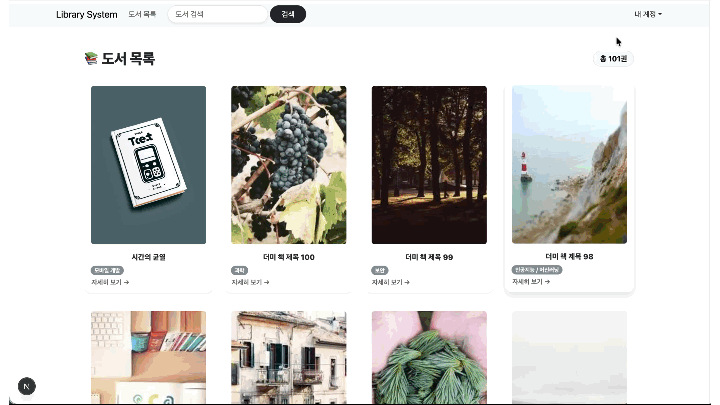
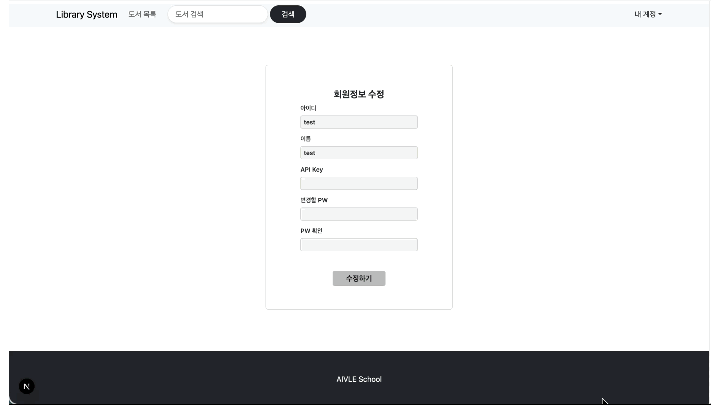
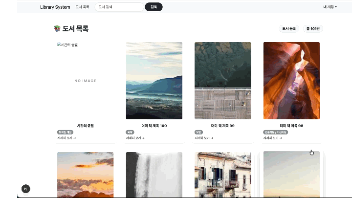
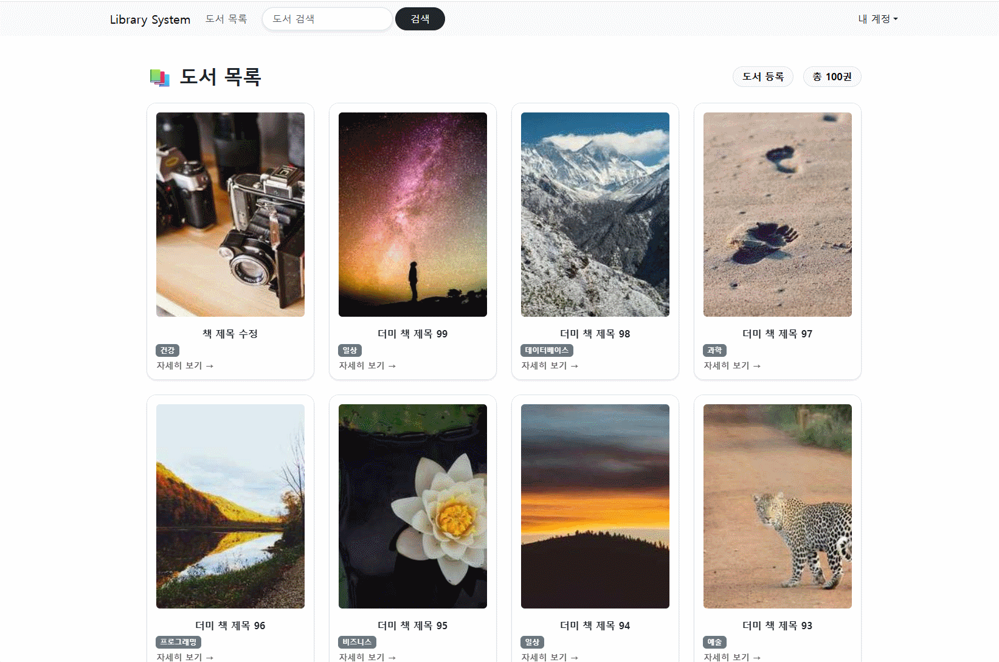
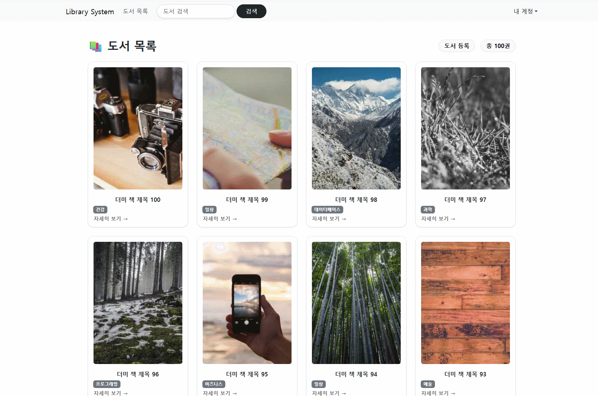
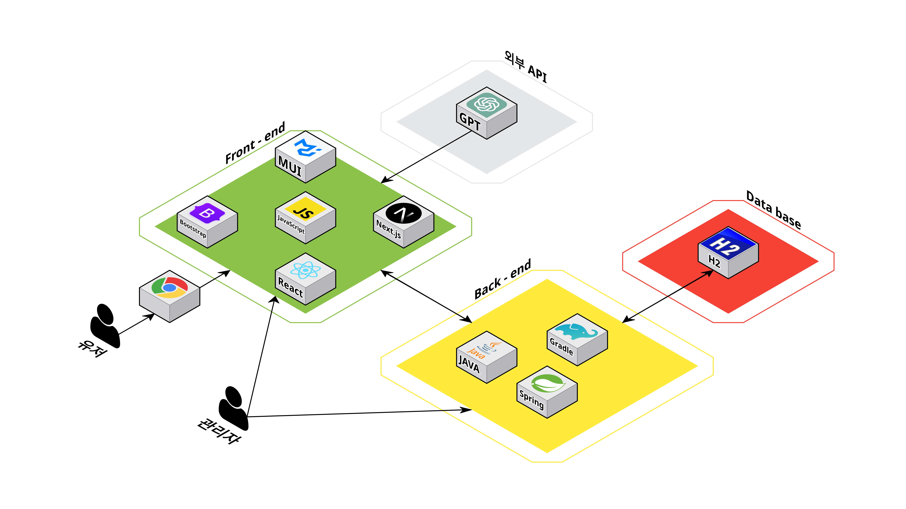
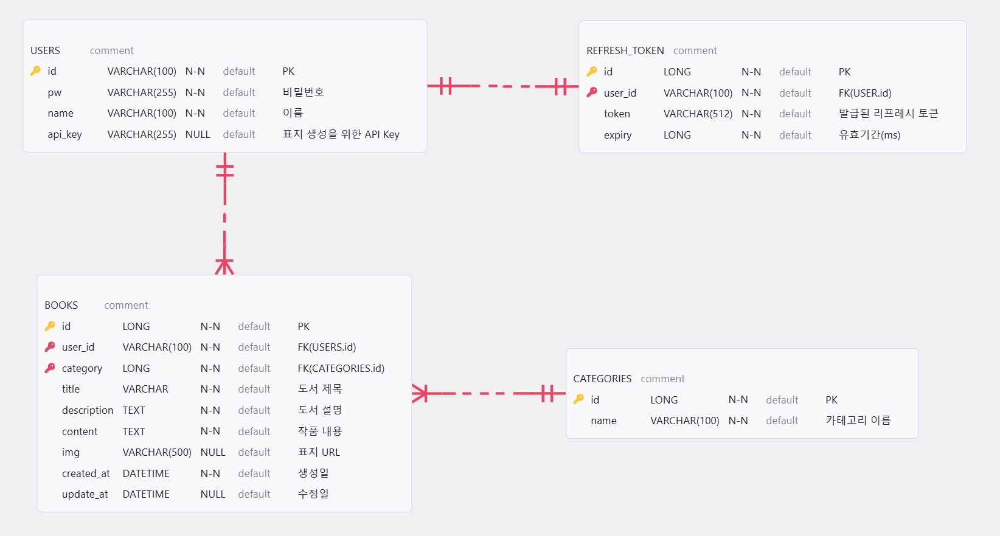
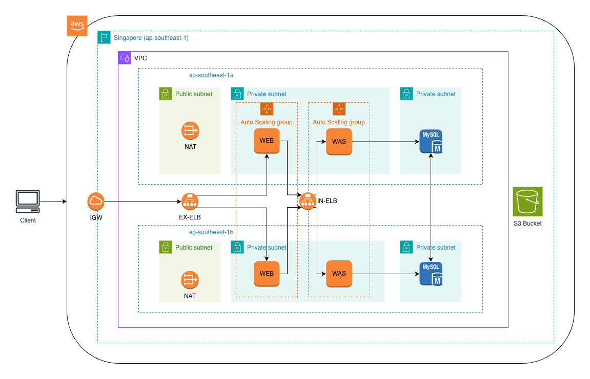
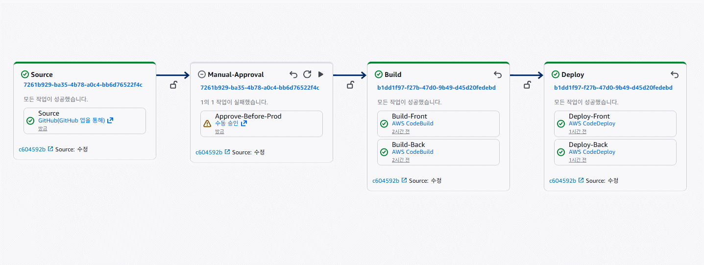

  <h1>미니 프로젝트 4차, 5차 - 부산/경남 10반</h1>
  <h3>📖 도서관리시스템 개발 📖</h3>

 

    <a href="https://www.notion.so/AIVLE-School-4-2bf994ebe25d80e386a7d101c97ffd0d">Notion</a>
    &nbsp; | &nbsp; 
    <a href="https://www.figma.com/design/r3jpdOz2xgUvo7j7NIQbUV/4%EC%B0%A8-%EB%AF%B8%EB%8B%88?node-id=0-1&p=f/">Figma</a>
    &nbsp; | &nbsp; 
    <a href="https://docs.google.com/spreadsheets/d/1El2XurvM0hBwo7mui5dlEC87zFCsDXSg/edit?gid=1349883987#gid=1349883987">API 명세서</a>
    &nbsp; | &nbsp;
    <a href="https://drive.google.com/file/d/156oOZrLlVBzqF2xauUfOO0wAcNBt04Zr/view?usp=sharing">AWS 시스템 아키텍처</a>

## ✍️ 프로젝트 개요

---

- **KT Aivle School 4차, 5차 미니프로젝트**
- **프로젝트 명: 도서관리시스템 (AI를 활용한 도서표지 이미지 생성)** 
- **프로젝트 기간: 2025.12.04(목) ~ 2025.12.09(화) ,  2025.12.18(목) ~ 2025.12.23(화)**

## ✍️ 프로젝트 소개

---

### 프로젝트 배경

---

본 프로젝트는 디지털 콘텐츠와 AI 기술의 발전으로 개인 창작자 중심의 출판 및 콘텐츠 제작 환경이 확산됨에 따라, 누구나 쉽게 도서를 등록하고 관리할 수 있는 플랫폼의 필요성에서 출발하였습니다.  
특히 기존 도서 관리 시스템이 단순한 정보 저장에 그치는 한계를 보이는 반면, 본 프로젝트는 AI를 활용한 도서 표지 이미지 자동 생성 기능을 결합하여 창작자의 기획 부담을 줄이고 시각적 완성도를 높이고자 하였습니다.  
또한 JWT 기반 인증과 보안 필터를 적용하여 안전한 사용자 인증 환경을 구축하고, 효율적인 도서 등록·조회·수정·삭제가 가능한 통합 도서 관리 시스템을 구현하는 것을 목표로 개발되었습니다.

## 🚀 프로젝트 목표

- Spring Boot와 React & NEXT.js를 활용한 풀스택 웹 애리케이션 개발 역량 강화.
- REST API 설계 및 구현.
- JPA를 이용한 데이터베이스 연동.
- 외부 API (OpenAI) 연동.

---

## 📌 주요 기능

1. **JWT 기반 회원 인증 기능**: 회원가입, 로그인, 회원탈퇴를 통해 사용자 인증과 권한을 안전하게 관리합니다.
2. **도서 등록 기능**: 인증된 사용자가 도서의 제목, 설명, 내용, 카테고리를 등록할 수 있으며 작성자는 JWT 기반으로 자동 설정됩니다.
3. **도서 목록 조회 및 페이징 처리**: 다수의 도서를 페이지 단위로 조회할 수 있으며, 현재 페이지와 전체 페이지 수 정보를 함께 제공합니다.
4. **도서 수정 및 삭제 기능**: 인증된 도서 작성자 본인의 도서 정보를 수정하거나 삭제할 수 있습니다.
5. **AI 기반 도서 표지 이미지 생성 기능**: 도서의 제목과 설명을 기반으로 AI가 자동으로 표지 이미지를 생성하고 저장합니다.
6. **공통 API 응답 구조 적용**: 모든 API 응답을 `status`, `message`, `data` 형식의 공통 응답 구조로 통일하여 관리합니다.
7. **MySQL 기반 데이터베이스**: MySQL DB를 사용하여 도서, 사용자, 카테고리, Refresh Token 데이터를 관리합니다.
8. **보안 필터 기반 인증 처리**: JWT 검증을 필터에서 일괄 처리하여 컨트롤러와 서비스의 보안 로직을 분리합니다.

---

## 🧑‍💻 팀원 소개

|           **양시현**            |   **박기준**    |    **배교성**    | **신다훈**  |
|:----------------------------:|:------------:|:-------------:|:--------:|
|            팀장, BE            |    팀원, FE    |    팀원, BE     |  팀원, FE  |
| 회원 관리 API,   JWT 기반 회원 인증 | 작품 목록 페이지 생성 | 도서 및 카테고리 API | 메인 화면 UI |

|       **이연호**        |         **이정제**          |    **이태훈**    | **장석진**  |
|:--------------------:|:------------------------:|:-------------:|:--------:|
|        팀원, FE        |          팀원, FE          |    팀원, BE     |  팀원, FE  |
| 도서 상세 보기,   도서 편집 | AI 기반 이미지 생성,  게시물 구성 | 도서 및 카테고리 API | 회원 관련 UI |

---
## ⚙️ 기술 스택

<table>
    <thead>
        <tr>
            <th>분류</th>
            <th>기술 스택</th>
        </tr>
    </thead>
    <tbody>
        <tr>
            <td>
                  
프론트엔드

            </td>
            <td>
                  
                  
                  
                  
                  
                  
            </td>
        </tr>
        <tr>
            <td>
                
백엔드

            </td>
            <td>
                
                
                
                
            </td>
        </tr>
        <tr>
            <td>
                
외부 API

            </td>
            <td>
                
            </td>
        </tr>
        <tr>
            <td>
                
협업 툴

            </td>
            <td>
                
                
                
            </td>
        </tr>
    </tbody>
</table>

---

### 회원 관리 기능
- **회원 가입**  
  

- **회원 정보 수정**  
  

- **회원 탈퇴**  
  

### 게시글 관련 기능
- **도서 등록**  
  

- **도서 수정**  
  

## Backend 개요
이 백엔드는 도서 작성/조회/수정/삭제 기능과 회원 인증(JWT)을 제공하는 REST API 서버입니다.  
프론트엔드가 호출하는 HTTP API를 통해 도서 콘텐츠 서비스를 지원합니다.

- **회원 관리 기능**
    - 회원가입 API를 통해 아이디·비밀번호·이름을 입력받아 새로운 회원을 생성한다.
    - JWT Access Token을 이용해 인증된 사용자의 이름·비밀번호·API Key를 수정하는 회원정보 수정 기능을 구현했다.
    - 비밀번호를 한 번 더 확인한 뒤, 본인 계정을 시스템에서 삭제하는 회원탈퇴 로직을 담당했다.

- **로그인·로그아웃 & 토큰 관리**
    - 아이디·비밀번호를 검증해 로그인 처리하고, 성공 시 Access Token과 Refresh Token을 함께 발급하는 인증 흐름을 구현했다.
    - 클라이언트가 전달한 Access Token을 무효화하거나 Refresh Token을 삭제하는 방식으로 로그아웃 기능을 구현했다.
    - Access Token의 만료 여부·위변조 여부를 확인하는 토큰 유효성 검사 API를 제공한다.
    - 쿠키에 저장된 Refresh Token을 사용해 새로운 Access Token을 재발급하는 토큰 재발급 기능을 개발했다.

- **JWT 기반 사용자/키 조회**
    - JWT Access Token에서 사용자 정보를 추출한 뒤, 해당 사용자에게 발급된 API Key를 조회해 반환하는 API를 구현했다.
    - 유효한 토큰을 전제로, 사용자 ID와 이름을 조회해 내려주는 “JWT 기반 사용자 정보 조회” 기능을 담당했다.

- **도서 목록 & 검색**
    - 페이지 번호를 기준으로 도서 목록을 조회하고, 페이지/전체 페이지 수/전체 아이템 수를 함께 내려주는 리스트 API를 구현했다.
    - 사용자가 입력한 검색어가 도서 제목에 포함된 경우만 필터링하여, 제목 기반 검색 결과를 페이징 형태로 반환하는 검색 API를 개발했다.

- **도서 등록·수정**
    - JWT 인증된 사용자가 제목, 설명, 본문, 카테고리, 이미지 URL 등을 포함해 새로운 도서를 등록하는 API를 구현했다.
    - 도서를 작성한 사용자만 자신의 도서 정보를 수정할 수 있도록 권한을 체크하고, 제목·내용·카테고리·이미지 등을 수정하는 로직을 담당했다.

- **카테고리 조회**
    - DB에 등록된 전체 카테고리 목록을 조회해, 카테고리 ID와 이름을 배열 형태로 반환하는 카테고리 조회 API를 구현했다.
    - 프론트엔드 드롭다운·필터에서 바로 사용할 수 있도록 응답 구조를 단순하게 설계했다.

- **도서 상세 조회**
    - 도서 ID를 입력받아 제목, 설명, 본문, 카테고리 ID, 이미지 URL, 작성자 ID, 생성/수정일자를 포함한 도서 상세 정보를 반환하는 API를 구현했다.
    - 존재하지 않는 도서 ID로 요청이 들어오면 “도서를 찾을 수 없습니다.” 에러 메시지를 내려주는 예외 처리 로직을 함께 담당했다.

- **도서 삭제**
    - JWT로 인증된 사용자 중, 해당 도서를 작성한 사용자만 삭제할 수 있도록 권한 체크 후 도서를 삭제하는 API를 구현했다.
    - 삭제 결과로 삭제된 도서 ID와 삭제 여부를 반환해, 프론트에서 후속 처리를 쉽게 할 수 있도록 했다.

- **카테고리·목록 보완 & 커버 이미지**
    - 도서 목록 및 카테고리 조회 로직을 다른 팀원과 함께 보완하면서, 응답 형식을 통일하고 공통 DTO 구조에 맞게 정리했다.
    - 도서 ID를 기반으로 커버 이미지 URL을 조회해 반환하는 API를 구현해, 상세 페이지에서 표지 이미지를 바로 사용할 수 있게 했다.

## 🔨 시스템 아키텍처

---

## 📊 ERD

---

## 🚀 클라우드 아키텍처 & CI/CD 구성

### 1️. 전체 클라우드 아키텍처 구성

AWS 환경에서 **ALB – EC2 – RDS**를 중심으로 한 클라우드 아키텍처를 구성했습니다.  
외부 사용자의 요청은 Application Load Balancer를 통해 유입되며,  
트래픽은 Auto Scaling Group에 포함된 EC2 인스턴스로 분산 처리됩니다.  
이를 통해 단일 서버 장애 상황에서도 서비스 가용성을 유지할 수 있도록 설계했습니다.

데이터베이스는 RDS Multi-AZ 구성을 적용하여 서로 다른 가용 영역(AZ)에  
Primary와 Standby 인스턴스를 배치했으며,  
장애 발생 시 자동 Failover가 이루어지는 고가용성 구조를 갖추었습니다.

---

### 2. ALB & Auto Scaling 기반 트래픽 분산 및 확장 구조

Application Load Balancer(ALB)와 Auto Scaling Group(ASG)을 활용해  
가용성과 확장성을 고려한 클라우드 아키텍처를 구성했습니다.

외부 요청은 ALB를 단일 진입 지점으로 하여 유입되며,  
Target Group에 등록된 EC2 인스턴스로 트래픽이 분산됩니다.  
이를 통해 특정 인스턴스에 부하가 집중되는 상황을 방지하고,  
안정적인 요청 처리가 가능하도록 설계했습니다.

Auto Scaling Group은 여러 가용 영역(AZ)에 걸쳐 인스턴스를 관리하며,  
헬스 체크를 기준으로 비정상 인스턴스를 자동으로 교체해  
단일 서버 장애 상황에서도 서비스 가용성을 유지합니다.

또한 CPU 사용률 등의 지표를 기준으로 인스턴스를 자동 확장·축소할 수 있는 구조를 갖추었으며,  
현재는 안정적인 운영을 위해 최소·최대 인스턴스 수를 동일하게 설정했습니다.

이를 통해 **트래픽 분산, 장애 대응, 확장성을 함께 고려한 클라우드 운영 환경**을 구현했습니다.

---

### 3. CI/CD 파이프라인 (CodePipeline 기반 자동 배포)

GitHub 저장소에 코드가 푸시되면 AWS CodePipeline이 자동으로 실행되도록 구성했습니다.  
파이프라인은 다음 단계로 구성됩니다.

- Source: GitHub 코드 변경 감지
- Manual-Approval: Email을 통해 배포 전 수동 승인을 받도록 구성
- Build: CodeBuild를 통한 애플리케이션 빌드 및 산출물 생성
- Deploy: CodeDeploy를 활용한 EC2 자동 배포

이 과정을 통해 수동 배포로 인한 실수를 줄이고,  
항상 동일한 환경에서 일관된 배포가 이루어지도록 CI/CD 환경을 구축했습니다.

---

